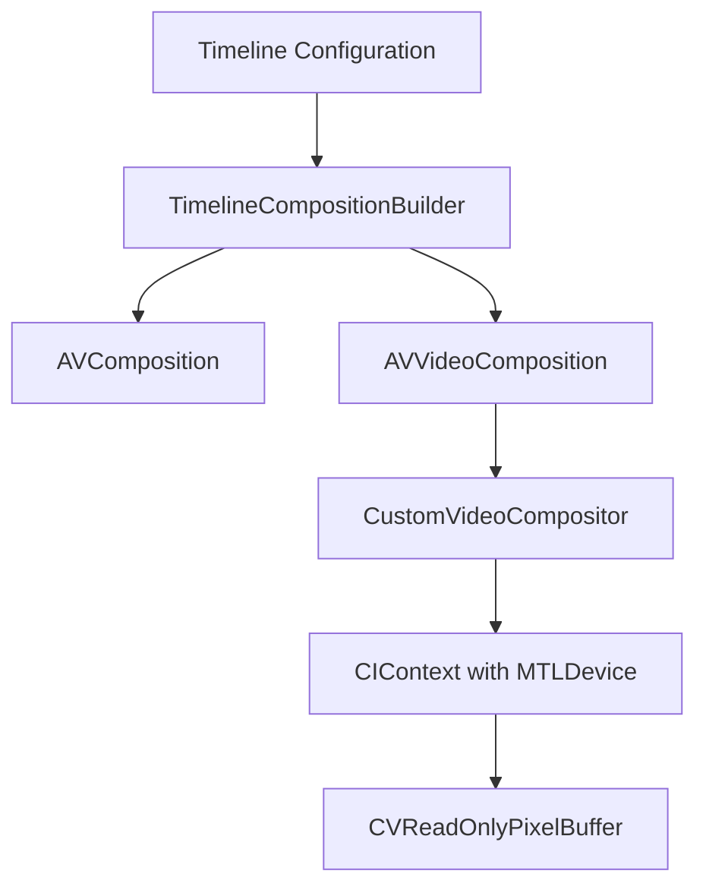

# VideoForge

**VideoForge** is a high-performance, modular video editing composition and rendering engine for iOS. Powered by **AVFoundation**, **Core Image**, and **Metal**, it provides a robust pipeline for building, previewing, and exporting complex multi-track video compositions.

Designed with SOLID principles and modern Swift structured concurrency, VideoForge can be integrated as a Swift Package or used as a standalone drag-and-drop module.

---

## Key Features

- 🎞️ **Multi-Track Editing**: Seamlessly handles overlapping video and audio tracks with alternating layout tracks to support clean cuts and cross-fades.
- 🎨 **GPU-Accelerated Compositing**: Custom `AVVideoCompositing` and `AVVideoCompositionInstruction` pipeline executing Core Image filters directly on Metal textures.
- ⚡ **Modern API Lifecycle**: Built using iOS 26+ configurations, utilizing async/await timeline building, and modern async throwing export APIs.
- 🔄 **Creative Transitions**: Built-in GPU-rendered transition effects including **Cross Dissolve**, **Wipe Left**, and **Slide Right**.
- 🖼️ **Overlays & PiP**: Supports high-fidelity Picture-in-Picture (PiP) video overlays with custom blending modes (Normal, Multiply, Screen, Overlay), scales, and rotations.
- 🏷️ **Dynamic Assets**: Support for text overlays with custom fonts and colors, alongside vector stickers using SF Symbols.
- 🌈 **Color Grading & LUTs**: Integrated `CIColorCube` filter processor supporting procedural color lookup tables (LUTs) including **Teal & Orange** and **Vibrant** profiles.

---

## Repository Structure

The project contains two main parts:
1. **`VideoEditorPipeline`**: The core rendering engine, marked with `public` access modifiers and packaged for Swift Package Manager.
2. **`VideoEditor` (Example App)**: A SwiftUI demonstration application that lets you manipulate timeline configurations, preview transitions in real-time, and run exports using the pipeline.

```
├── Package.swift                 # Swift Package Manager Manifest
├── VideoEditor_Pipeline_Docs.pdf # Technical Pipeline Documentation
├── VideoEditor/
│   ├── VideoEditorPipeline/      # Core Drag-and-Drop Library
│   │   ├── Core/                 # Compositor, Builder, Transitions, Processors
│   │   ├── Models/               # Timeline, Clip, Transition, Overlay models
│   │   └── Services/             # LUT Generators & Color cubes
│   ├── Services/                 # Mock Generator (for SwiftUI Example)
│   ├── Views/                    # SwiftUI Playback & Timeline Controls
│   └── VideoEditorApp.swift      # Example App Entry Point
```

---

## Getting Started

### Installation

#### Option 1: Swift Package Manager (Recommended)
Add the dependency to your `Package.swift`:
```swift
dependencies: [
    .package(url: "https://github.com/asitkumarxc101/VideoForge.git", from: "1.0.0")
]
```

#### Option 2: Drag and Drop
Copy the `VideoEditor/VideoEditorPipeline/` folder directly into your Xcode project and add it to your application targets.

### Usage Example

Here is how you compile and render a timeline using the pipeline:

```swift
import VideoEditorPipeline
import AVFoundation

// 1. Initialize a Timeline configuration
var timeline = Timeline(canvasResolution: .p1080Landscape, fps: 30)

// 2. Add video clips
let clip1 = VideoClip(
    sourceURL: videoURL1,
    timelineTimeRange: CMTimeRange(start: .zero, duration: CMTime(seconds: 5.0, preferredTimescale: 600)),
    sourceTimeRange: CMTimeRange(start: .zero, duration: CMTime(seconds: 5.0, preferredTimescale: 600))
)
timeline.videoClips.append(clip1)

// 3. Apply color grading LUT
timeline.videoClips[0].activeLUT = .tealAndOrange

// 4. Compile the composition and video composition configuration
let builder = TimelineCompositionBuilder.shared
let result = try await builder.buildComposition(from: timeline)

// 5. Export using modern iOS 26+ Concurrency APIs
let exportSession = AVAssetExportSession(
    asset: result.composition,
    presetName: AVAssetExportPresetHighestQuality
)!
exportSession.videoComposition = result.videoComposition
exportSession.audioMix = result.audioMix
exportSession.shouldOptimizeForNetworkUse = true

// Start monitoring the export state asynchronously
let stateMonitorTask = Task {
    for await state in exportSession.states(updateInterval: 0.1) {
        if case .exporting(let progress) = state {
            print("Exporting: \(progress.fractionCompleted * 100)%")
        }
    }
}

// Perform export
try await exportSession.export(to: outputURL, as: .mp4)
stateMonitorTask.cancel()
print("Export completed successfully!")
```

---

## Technical Details

### GPU Rendering Architecture


At its core, **VideoForge** implements custom Swift bindings for `AVVideoCompositing`. Frame rendering is dispatched onto a serial, high-priority background queue. The custom compositor manages image buffers on the GPU, avoiding CPU-to-GPU overhead by operating directly within a Metal-backed `CIContext`.

---

## Requirements

- **iOS**: 26.0+
- **Xcode**: 17.0+
- **Swift**: 5.9+
- **Frameworks**: AVFoundation, AVKit, CoreImage, Metal, UIKit

## License

This project is licensed under the MIT License.
